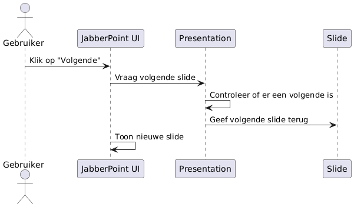
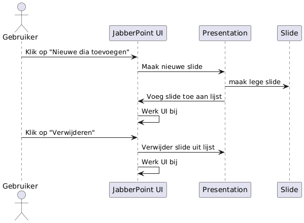
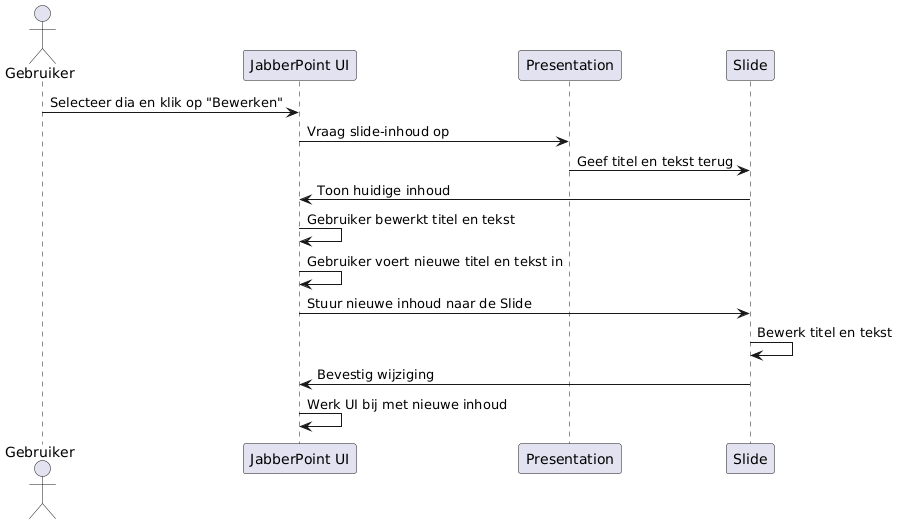
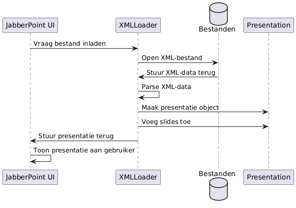
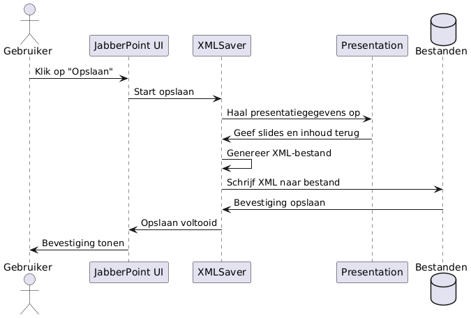

# JabberPoint Diagrammen

Dit project bevat verschillende diagrammen die de werking van **JabberPoint** uitleggen. 

---

## Navigeren door dia's (Volgende/Vorige slide)

Dit diagram toont het proces van het navigeren door dia's (volgende/voorgaande) in JabberPoint.

---

## Toevoegen/verwijderen van dia's

Dit diagram laat zien hoe dia's toegevoegd of verwijderd kunnen worden binnen JabberPoint.

---

## Bewerken van dia-inhoud (Titel en tekst aanpassen)

Dit diagram toont het proces van het bewerken van de inhoud (titel en tekst) van een dia in JabberPoint.

---

## Openen van een presentatie

Dit diagram toont hoe een presentatie wordt geopend in JabberPoint, inclusief het laden van de dia's uit een bestand.

---

## Opslaan van een presentatie

Dit diagram toont hoe de huidige presentatie wordt opgeslagen, waarbij de wijzigingen naar een bestand worden weggeschreven.

---

